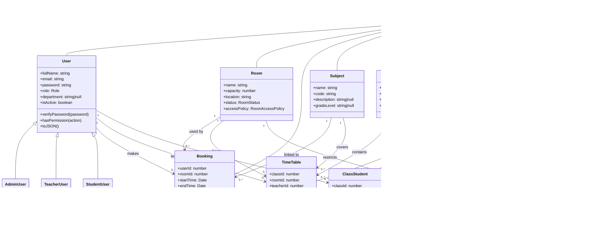

# Room Booking System Diagrams

This document is based on the current model layer under [src/models](../src/models).

## 1) ERD (Entity Relationship Diagram)

```mermaid
erDiagram
    USER ||--o{ BOOKING : makes
    ROOM ||--o{ BOOKING : is_used_in
    SUBJECT ||--o{ BOOKING : belongs_to
    USER ||--o{ TIMETABLE : teaches
    ROOM ||--o{ TIMETABLE : hosts
    SUBJECT ||--o{ TIMETABLE : taught_as
    CLASS ||--o{ TIMETABLE : has
    CLASS ||--o{ CLASS_STUDENT : contains
    USER ||--o{ CLASS_STUDENT : enrolls
    ROOM ||--o{ ROOM_ACCESS_RULE : has
    ROLE ||--o{ ROLE_PERMISSION : grants
    PERMISSION ||--o{ ROLE_PERMISSION : is_assigned_to

    USER {
      int id
      string fullName
      string email
      string password
      enum role
      string department
      bool isActive
    }

    BOOKING {
      int id
      int userId
      int roomId
      datetime startTime
      datetime endTime
      string purpose
      int subjectId
      enum status
      int approvedBy
      datetime approvedAt
    }

    ROOM {
      int id
      string name
      int capacity
      string location
      enum status
      enum accessPolicy
    }

    SUBJECT {
      int id
      string name
      string code
      string description
      string gradeLevel
    }

    CLASS {
      int id
      string name
      string gradeLevel
      int teacherId
      string academicYear
    }

    TIMETABLE {
      int id
      int classId
      int roomId
      int teacherId
      int subjectId
      string dayOfWeek
      string startTime
      string endTime
    }

    CLASS_STUDENT {
      int id
      int classId
      int studentId
      datetime enrolledAt
    }

    ROOM_ACCESS_RULE {
      int id
      int roomId
      enum allowedRole
      bool requiresApproval
      int approverId
    }

    ROLE {
      enum name
    }

    PERMISSION {
      int id
      string action
      string description
    }

    ROLE_PERMISSION {
      int id
      enum role
      int permissionId
    }
```

## 2) UML Class Diagram


```
